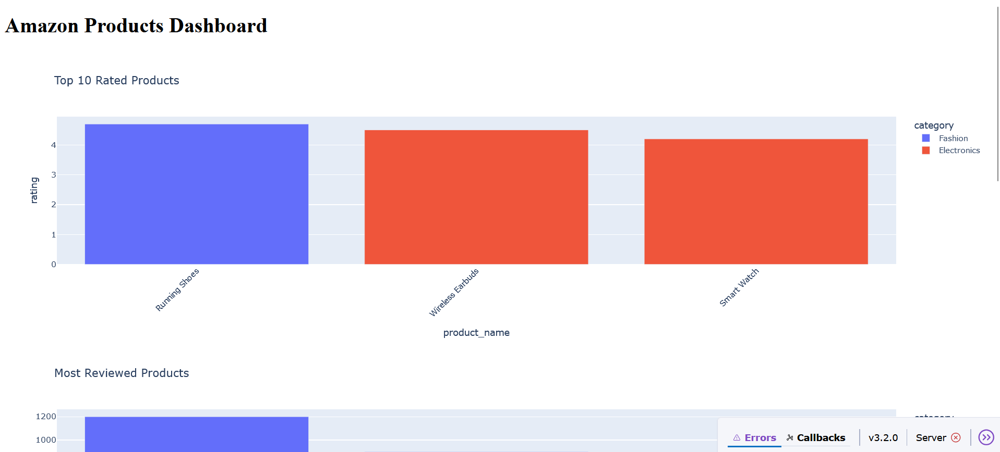

# Data Automation & Dashboard Suite

A Python-based solution for **automating data processing tasks** and creating **interactive dashboards** for visualization and insights. This project leverages Python libraries such as Pandas, NumPy, Matplotlib, Seaborn, Plotly, and Dash to handle data efficiently and present it in a user-friendly way.

---

## 🛠 Features

- **Automated Data Processing**: Python scripts for cleaning, transforming, and processing datasets.  
- **Interactive Dashboards**: Visualize data trends and insights using Dash, Plotly, Matplotlib, and Seaborn.  
- **Multiple Visualization Options**: Supports line charts, bar charts, scatter plots, and heatmaps.  
- **User-Friendly Interface**: Simple dashboards that provide actionable insights.  
- **Custom Reports**: Generate automated reports from processed data.  

---

## 💻 Technologies Used

- **Programming Language**: Python  
- **Libraries**: Pandas, NumPy, Matplotlib, Seaborn, Plotly, Dash  
- **Concepts**: Data Processing, Automation, Data Visualization, Object-Oriented Programming (OOP)  

---

## 📂 Project Structure

Data-Automation-Dashboard-Suite/
│
├── data_processing.py # Scripts for automating data tasks
├── dashboard_app.py # Dash/Plotly dashboard application
├── visualizations.py # Visualization functions using Matplotlib & Seaborn
├── requirements.txt # Required Python packages
└── README.md # Project documentation


# Amazon Products Dashboard

This project contains automation scripts and a Dash dashboard.

## 📸 Screenshot



## run_all.py
replace with email id
   sender_email = os.getenv("SENDER_EMAIL", "add@gmail.com")
    sender_password = os.getenv("SENDER_PASSWORD", "app_password")
    receiver_email = os.getenv("RECEIVER_EMAIL", "rec@gmail.com")


---

## 🚀 Installation

1. **Clone the repository**
```bash
git clone https://github.com/your-username/Data-Automation-Dashboard-Suite.git
Navigate to the project directory


python3 -m venv venv

for window -  venv/Scripts/activate
for mac/linux - source venv/bin/activate

cd Data-Automation-Dashboard-Suite

pip install -r requirements.txt
Run the Dashboard

python dashboard_app.py


# for send mail 
python run_all.py
